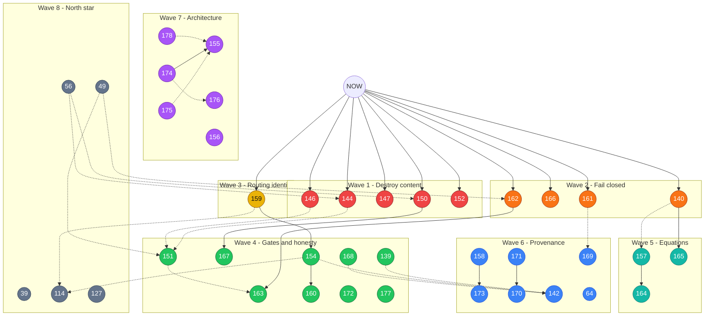

# Open-issue priority graph

41 open issues ranked for parallel development.
Criterion: silent content loss → tables/figures → knob honesty → architecture → north-star.

**Legend**

- Solid arrow = hard dependency (do source first)
- Dotted arrow = soft dependency (easier / cleaner after)
- Waves are numbered 1–8; same-wave nodes can run in parallel unless an arrow says otherwise

Open in Obsidian: [`issue-priority-graph.canvas`](issue-priority-graph.canvas)

## Node key

| ID | Title | Wave |
|---|---|---|
| 150 | charts extracted as tables | 1 |
| 144 | rowizer drops numeric values | 1 |
| 147 | landscape transposed | 1 |
| 146 | data row as header | 1 |
| 152 | side-by-side tables merged | 1 |
| 162 | verifier exceptions fail open | 2 |
| 166 | crop failures look clean | 2 |
| 161 | resume skips audit-failed | 2 |
| 140 | math-font trusted native | 2 |
| 159 | ProviderProfile identity discarded | 3 |
| 151 | recall is not a structure gate | 4 |
| 167 | any raster routes to chart | 4 |
| 163 | OCR word defers scan gate | 4 |
| 154 | cloud priced at $0 | 4 |
| 160 | escalation ignores budget | 4 |
| 139 | `--no-audit` inert | 4 |
| 168 | config/profile dropped | 4 |
| 172 | soft timeout hang | 4 |
| 177 | single-file exit codes | 4 |
| 157 | equation attach needs PageOutput | 5 |
| 165 | PUA math miss | 5 |
| 164 | full-page dump on reject | 5 |
| 158 | blank model_version | 6 |
| 173 | fingerprint incomplete | 6 |
| 171 | terminal before figures | 6 |
| 170 | replay ignores assets | 6 |
| 169 | drop rejection reasons | 6 |
| 142 | full flag audit | 6 |
| 64 | audit native fallthrough | 6 |
| 178 | Python-not-Rust ADR | 7 |
| 174 | quarantine legacy | 7 |
| 175 | package layering | 7 |
| 176 | dumb DocumentState | 7 |
| 155 | split orchestrator | 7 |
| 156 | TODO/TICKETS drift | 7 |
| 49 | three-layer method | 8 |
| 39 | quality-per-dollar | 8 |
| 114 | post-hoc escalate | 8 |
| 127 | native structure loss | 8 |
| 56 | CE umbrella tracker | 8 |

## Critical paths

1. Citation-safe tables: `(144|146|147|152) -> 151` and `(162|166) -> 163`, plus `150 -> 167`
2. Honest agentic product: `159 -> 154 -> 160 -> 142` and `174 -> 155`
3. Equations: `140 -> 165` and `157 -> 164`
