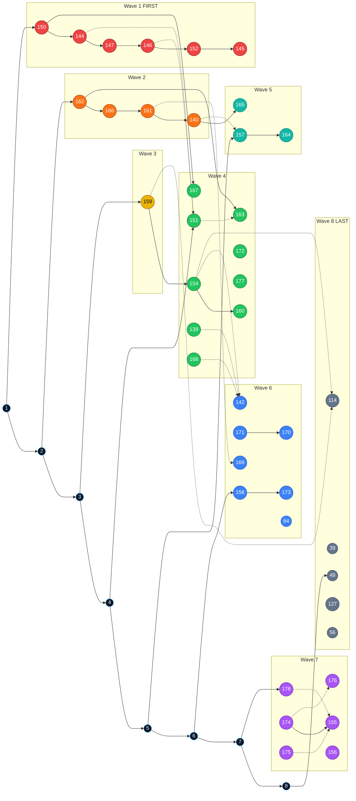

# Open-issue priority graph

**Do lower wave numbers first.** Wave 1 before Wave 2 before Wave 3…  
Within a wave, top node = highest priority. Same-wave issues can run in parallel.

Criterion: silent content loss → tables/figures → knob honesty → architecture → north-star.

Open in Obsidian: [`issue-priority-graph.canvas`](issue-priority-graph.canvas)

Root index: [`../../TODO.md`](../../TODO.md) · Per-issue plans: [`issue-priority/TICKETS.md`](issue-priority/TICKETS.md)

---

## Start here (single-lane order)

If one person / one agent: work top to bottom. Stop for hard deps only.

1. **#150** charts extracted as tables
2. **#144** rowizer drops numbers
3. **#147** landscape transposed
4. **#146** data row as header
5. **#152** side-by-side merge
6. **#145** one-point overlap deletes prose
7. **#162** verifier fail-open
8. **#166** crop failures look clean
9. **#161** resume skips audit-failed
10. **#140** math-font trusted native
11. **#159** ProviderProfile identity
12. **#151** structure gate *(after 144/146 preferred)*
13. **#167** not every raster is a chart *(after 150)*
14. **#163** OCR deferral *(after 162)*
15. **#154** cloud priced $0 *(after 159)*
16. **#160** escalation budget *(after 154)*
17. **#139** `--no-audit` inert
18. **#168** config/profile dropped
19. **#172** soft timeout hang
20. **#177** exit-code mismatch
21. **#157** equation attach → then **#164**
22. **#165** PUA math *(after 140)*
23. **#158** model_version → then **#173**
24. **#171** figures before terminal → then **#170**
25. **#169** rejection reasons · **#64** fallthrough · **#142** flag audit last in this band
26. **#178** ADR · **#174** quarantine → **#155** split · **#175/#176/#156** alongside
27. Wave 8 is design only (**#49 #39 #114 #127 #56**) — not coding tickets

---

## Schedule graph (left = first)

Read **left → right**. Colored columns are waves. Solid edges = must finish source first. Dotted = nicer after, not blocking.

---

## Multi-lane (max parallelism)

| Lane | Starts at | Issues in order |
|---|---|---|
| **A Content** | Wave 1 | 150 → 144 → 147 → 146 → 152 → 151 → 167 |
| **B Trust** | Wave 2 | 162 → 166 → 161 → 163 · 140 → 165 |
| **C Routing** | Wave 3 | 159 → 154 → 160 → 142 |
| **D CLI** | Wave 4 | 139 · 168 · 172 · 177 |
| **E Equations** | Wave 5 | 157 → 164 |
| **F Provenance** | Wave 6 | 158 → 173 · 171 → 170 · 169 · 64 |
| **G Arch** | Wave 7 | 178 · 174 → 155 · 175 · 176 · 156 |

Lanes A/B/C can start together on day one. D waits only on people, not deps. E needs 140 for 165. F/G after the product-honesty spine is moving.

---

## Node key

| ID | Title | Wave | Rank in wave |
|---|---|---|---|
| 150 | charts extracted as tables | 1 | 1 |
| 144 | rowizer drops numeric values | 1 | 2 |
| 147 | landscape transposed | 1 | 3 |
| 146 | data row as header | 1 | 4 |
| 152 | side-by-side tables merged | 1 | 5 |
| 145 | one-point overlap deletes prose | 1 | 6 |
| 162 | verifier exceptions fail open | 2 | 1 |
| 166 | crop failures look clean | 2 | 2 |
| 161 | resume skips audit-failed | 2 | 3 |
| 140 | math-font trusted native | 2 | 4 |
| 159 | ProviderProfile identity discarded | 3 | 1 |
| 151 | recall is not a structure gate | 4 | 1 |
| 167 | any raster routes to chart | 4 | 2 |
| 163 | OCR word defers scan gate | 4 | 3 |
| 154 | cloud priced at $0 | 4 | 4 |
| 160 | escalation ignores budget | 4 | 5 |
| 139 | `--no-audit` inert | 4 | 6 |
| 168 | config/profile dropped | 4 | 7 |
| 172 | soft timeout hang | 4 | 8 |
| 177 | single-file exit codes | 4 | 9 |
| 157 | equation attach needs PageOutput | 5 | 1 |
| 165 | PUA math miss | 5 | 2 |
| 164 | full-page dump on reject | 5 | 3 |
| 158 | blank model_version | 6 | 1 |
| 173 | fingerprint incomplete | 6 | 2 |
| 171 | figures before terminal | 6 | 3 |
| 170 | replay ignores assets | 6 | 4 |
| 169 | drop rejection reasons | 6 | 5 |
| 142 | full flag audit | 6 | 6 |
| 64 | audit native fallthrough | 6 | 7 |
| 178 | Python-not-Rust ADR | 7 | 1 |
| 174 | quarantine legacy | 7 | 2 |
| 175 | package layering | 7 | 3 |
| 176 | dumb DocumentState | 7 | 4 |
| 155 | split orchestrator | 7 | 5 |
| 156 | TODO/TICKETS drift | 7 | 6 |
| 49 | three-layer method | 8 | design |
| 39 | quality-per-dollar | 8 | design |
| 114 | post-hoc escalate | 8 | design |
| 127 | native structure loss | 8 | design |
| 56 | CE umbrella tracker | 8 | tracker |
